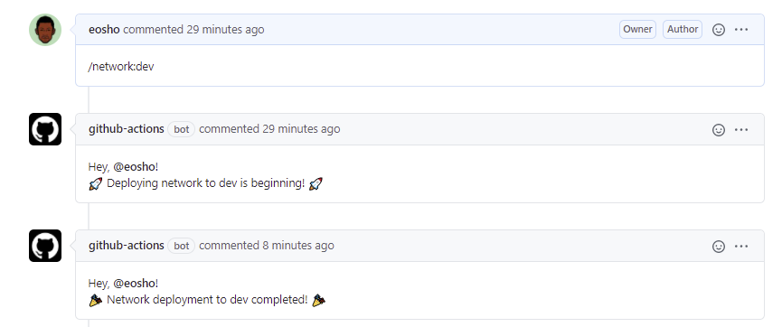

# Azure PaaS Reference Design

This reference design implements a hub-and-spoke networking model with all data plane operations happening within VNets through the use of Private Link. This design establishes a clear network perimeter and includes centralized control of all ingress and egress traffic by way of Azure Firewall deployed in the hub VNet. Many aspects of this design are enforced via Azure Policy to ensure a seucre baseline is maintained.


## Deployment

This reference environment includes two main areas that are deployed in the target subscription.

* [Azure Policies](policies/readme.md) - Ensure a conssitent security baseline is maintained
* [Azure Infrastructure](deployments/readme.md) - Represents the solution design
* [Azure Monitoring](monitoring/readme.md) - Contains information about what's being monitored

Navigate to each link before for instructions on how these assets are be deployed.

### CI-CD Workflow

Deployments of each components utlizied in this solution can be deployed & tested with the process of chatOps. The full process is as follows:

1. Developer creates a feature branch for changes to code, and pushes changes to the branch.
1. When the developer is ready, a PR is created to merge the changes into main.
1. A team member will review the changes.
1. If changes are approved, an issue comment `/{component}:{environment}` is issued. This triggers a GitHub action to:
   - compile and unit test the code (if any)
   - provision resources in Azure, or
   - configure settings on resources
1. After deployment to a motified component is complete you can trigger other components for testing.
1. The PR is then merged to main to complete the loop.

> **NOTE**
> Environment can be either one of the following:
> - dev
> - uat
> - prod
>
> This is also validated/enforced in the `application.bicep` and `networking.bicep` template files as allowed parameter values.
>
> ```txt
> param environment string {
>   allowed: [
>     'dev'
>     'uat'
>     'prod'
>   ]
> }
> ```

### ChatOps
The messages that are issues must be on a single line and have the following syntax:

| Component | Pipeline Name | Note | How to Deploy |
|---|---|---|---|
|`core`| `core.yml` | Deploys all core infra component | During a PR request simply type `/core:{environment}` to test and validate |
|`monitoring`| `monitoring.yml` | Deploys all monitoring component (diagnostics, alerts & dashboard) | During a PR request simply type `/monitoring:{environment}` to test and validate monitoring |
|`app`| `app.yml` | Deploys all app infrastructure | During a PR request simply type `/app:{environment}` to test and validate |
|`full`| `ci-cd.yml` | Triggers full deployment pipeline | During a PR request simply type `/full:{environment}` to deploy whole environment |
|`teardown`| `teardown.yml` | Tear down entire environment | During a PR request simply type `/teardown:{environment}` to delete all resource groups |

### Example

To deploy core infra components in the dev environment, simply write `/core:dev` in your pull request comment. This will automatically trigger the `core-infra-deploy` pipeline and deploy all necessary infrasturcture into the Dev environment (resource group).



### Prerequisites

In order to utilize the automated deployment pipelines, you need to configure the following:
1. Create a Service Principal in Azure
    ```azurecli
    az ad sp create-for-rbac --name "{sp-name}" --sdk-auth --role contributor \
        --scopes /subscriptions/{subscription-id}
    ```
    Replace the following:

      * `{sp-name}` with a suitable name for your service principal, such as the name of the app itself. The name must be unique within your organization.
      * `{subscription-id}` with the subscription ID you want to use (found in Subscriptions in portal)
1. Fill out the information as displayed in the JSON:
    ```json
    {
      "clientId": "<GUID>",
      "clientSecret": "<GUID>",
      "subscriptionId": "<GUID>",
      "tenantId": "<GUID>"
    }
    ```
1. In your repository, use Add secret to create a new secret named `AZURE_CREDENTIALS` and paste the contents of the JSON above.
1. Lastly, create another secret called `VM_ADMIN_PASSWORD` and enter a random password.

You should be set to utilize the pipeline without any issues now.

### Pipeline Parameters

The following is a list of parameters needed at runtime to run/provision the environment.

| Parameter | Default Value | Type | Description |
|---|---|---|---|
|`LOCATION`| `centralus` | string | Deployment region |
|`APP_PREFIX`| `wbademo` | string | App prefix name |
|`SQL_ADMIN_OBJECT_ID`| | string | Name The object Id of the user - needed for SQL |
|`SQL_ADMIN_LOGIN_NAME`| | string | SQL admin user name |
|`SQL_ADMIN_PASSWORD`| `${{ env.SQL_ADMIN_PASSWORD }}` | secureString | Create a secret in your repo settings. Sql admin password |
